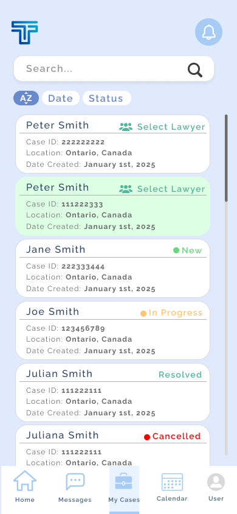
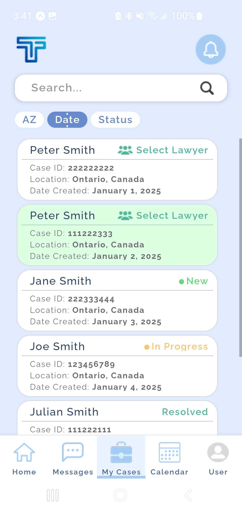
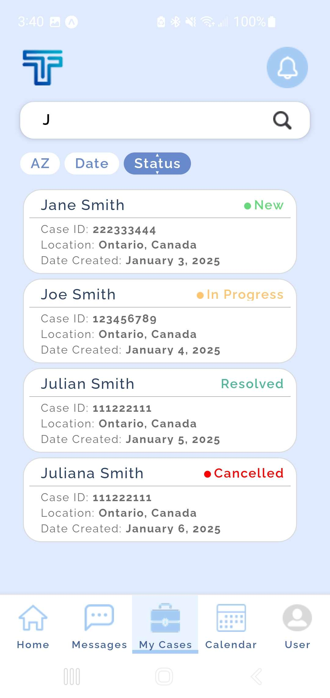
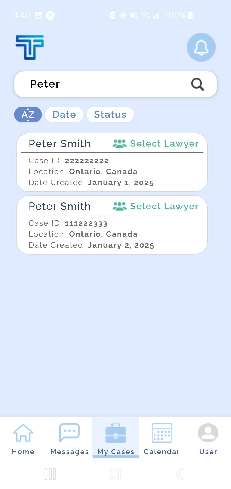

## TiketFix Assessment

The goal of this assessment was to implement a figma design as a react native one pager. Aside from the single page, basic routing and case searching/filtering were also implemented.

### Original Design

### Expo Screenshots

Demonstrating date sorting and case highlighting.

Demonstrating status sorting and case filtering.

Demonstrating A-Z sorting and case filtering.